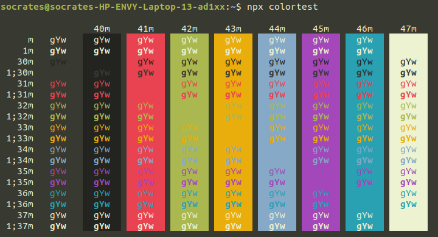

<p align="center">
    <picture>
        
    </picture>
</p>

<p align="center">An SAF multi-service branch inspired GNOME terminal color theme</p>
<p align="center">
Designed for a fluent and clear workflow, based on the color schemes from the uniforms and insignias of the Singapore Army, the Republic of Singapore Navy, the Republic of Singapore Airforce, and the Digital and Intelligence Service.
</p>

<p align="center">
  <picture>
    
  </picture>
</p>

## Getting started

### Requirements

The installation script requires [`dconf`][dconf] and `uuidgen` ([`util-linux`][util-linux]) to be available on your _PATH_ to create a new profile and generate a random profile UUID.

Some distributions may require additional package(s):

- `dconf-tools` - transitional package for `dconf-cli` and `dconf-editor` ([Debian][debian-dconf-tools], [Mint][mint-dconf-tools], [Ubuntu][ubuntu-dconf-tools])
- `dconf-gsettings-backend` to ensure _GSettings_ compatibility ([Debian][debian-dconf-gsettings-backend], [Mint][mint-dconf-gsettings-backend], [Ubuntu][ubuntu-dconf-gsettings-backend])
- `dconf-cli` to ensure full CLI support ([Debian][debian-dconf-cli], [Mint][mint-dconf-cli], [Ubuntu][ubuntu-dconf-cli])
- `dconf-service` to ensure D-Bus support for the _GSettings_ backend ([Debian][debian-dconf-service], [Mint][mint-dconf-service], [Ubuntu][ubuntu-dconf-service])
- `uuid-runtime` to provide runtime components for the Universally Unique ID library ([Debian][debian-uuid-runtime], [Mint][mint-uuid-runtime], [Ubuntu][ubuntu-uuid-runtime])

The packages should be available for all distributions using the GNOME Terminal by default.

### Installation

1. Clone this repository
   ```sh
   git clone https://github.com/roycehoe/saf-gnome-terminal.git
   cd saf-gnome-terminal/
   ```
2. Run the [`apply_theme.sh`](https://github.com/roycehoe/saf-gnome-terminal/blob/master/apply_theme.sh) shell script to start the automated installation.
